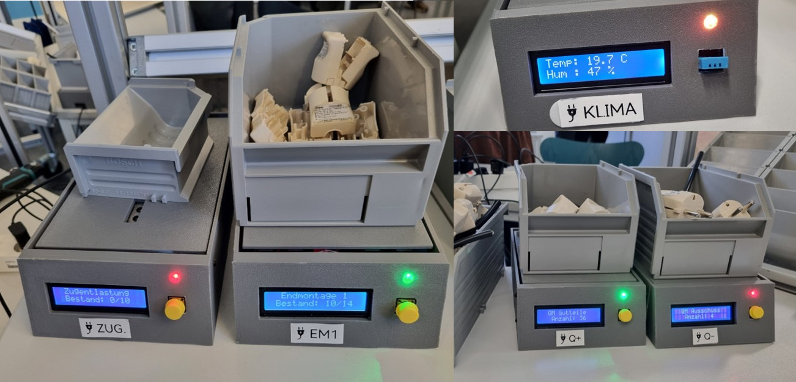

# 🏭 ESP8266 MQTT Scale – Intelligente Waagen für die Modellfabrik „NordSteck"

> Cyber-Physisches System (CPS) zur Echtzeit-Prozessüberwachung in einer Lean-Modellfabrik.  
> Entwickelt im Rahmen des Moduls **Prozess- und Operationsmanagement**.

---

## 📋 Übersicht

Dieses Repository enthält den vollständigen Quellcode für ein IoT-basiertes Waagensystem, das auf dem **ESP8266 (Wemos D1 R2)** Mikrocontroller aufbaut. Sechs identische Hardware-Einheiten mit jeweils angepasster Software erfassen Prozessdaten in einer Modellfabrik und übermitteln diese in Echtzeit per **MQTT** an ein zentrales **Raspberry Pi Gateway** mit **Node-RED**.

### Kernfunktionen
- ⚖️ **Gewichtsbasierte Stückzahlerfassung** mittels HX711 / Dehnungsmessstreifen (DMS)
- 📡 **Echtzeit-Datenübertragung** über MQTT (Publish/Subscribe)
- 🚦 **Lokales Andon-System** mit RGB-LED (Ampel) und 16×2 LCD-Display
- 🔄 **Tare-Funktion** per physischem Taster
- 🌡️ **Umgebungssensorik** (Temperatur & Luftfeuchtigkeit via DHT11)
- 📊 **Dashboard-Visualisierung** über Node-RED (Andon-Beamer, Management-Laptop, Lieferanten-Smartphone)

---

## 🗂️ Projektstruktur

```
esp8266-mqtt-scale/
├── calibration/
│   └── calibration.ino        # Kalibrierungstool für den HX711
├── zugentlastung/
│   ├── zugentlastung.ino      # Basis-Algorithmus: Vormontage Zugentlastung
│   └── secrets.h              # WLAN- & MQTT-Konfiguration
├── endmontage/
│   ├── endmontage.ino         # Modifizierter Algorithmus: Endmontage (EM1/EM2)
│   └── secrets.h              # WLAN- & MQTT-Konfiguration
├── quality/
│   ├── quality.ino            # Inkrementeller Zähler: Qualitätskontrolle (Gut/Schlecht)
│   └── secrets.h              # WLAN- & MQTT-Konfiguration
├── climate_monitor/
│   ├── climate_monitor.ino    # Sonderfall: Temperatur- & Feuchtigkeitssensor (DHT11)
│   └── secrets.h              # WLAN- & MQTT-Konfiguration
├── wiring_guide.md            # Pin-Belegung / Verdrahtungsplan
└── README.md
```

---

## ⚙️ Hardware

### Komponenten pro Waage
| Komponente | Beschreibung |
|---|---|
| **Wemos D1 R2** | Mikrocontroller mit ESP8266 & integriertem WiFi |
| **HX711** | 24-Bit A/D-Wandler mit Vorverstärker für die Wägezelle |
| **Dehnungsmessstreifen (DMS)** | Wägezelle / Load Cell (Biegebalken-Prinzip) |
| **I2C LCD 16×2** | Display zur Anzeige von Station und Bestand |
| **RGB LED (Common Cathode)** | Andon-Ampel (Rot / Orange / Grün) |
| **Taster** | Tare / Reset / Restock-Funktion |
| **DHT11** *(nur climate_monitor)* | Temperatur- und Luftfeuchtigkeitssensor |

### Verdrahtung (Pin-Belegung)

Die vollständige Pin-Belegung ist in [`wiring_guide.md`](wiring_guide.md) dokumentiert. Kurzübersicht:

| Peripherie | Pin am Wemos D1 R2 |
|---|---|
| HX711 DT (Data) | **D5** (GPIO 14) |
| HX711 SCK (Clock) | **D6** (GPIO 12) |
| LCD SDA | **D14** (GPIO 4) |
| LCD SCL | **D15** (GPIO 5) |
| Taster (Signal) | **D7** (GPIO 13) |
| Taster (GND) | **RX** (GPIO 3, Virtual GND) |
| LED Rot | **TX** (GPIO 1) |
| LED Grün | **D2** (GPIO 16) |
| LED Blau | **D10** (GPIO 15) |

> **Hinweis:** Die Pins **D3** und **D4** (GPIO 0 / 2) bleiben frei – sie können im Boot-Mode Probleme verursachen, wenn Peripherie angeschlossen ist.

---

## 🧠 Software-Varianten

Die sechs Waagen nutzen identische Hardware, unterscheiden sich aber in ihrer Software-Konfiguration:

### 1. `zugentlastung/` – Basis-Algorithmus (Vormontage)
- **Prinzip:** Stückzahl = Gesamtgewicht ÷ Einzelteilgewicht
- **Anwendung:** Bestandsüberwachung von Kleinteilen (Zugentlastungen, ~1,58 g/Stk.)
- **Puffer:** 4 Einheiten (digitales Kanban)
- **LED-Logik:** Grün (1–3) · Orange (4) · Rot (0 oder >4) · Rot blinkend (>5)
- **MQTT Topic:** `factory/scale/zugentlastung`

### 2. `endmontage/` – Modifizierter Algorithmus (Endmontage 1 & 2)
- **Prinzip:** Wie Zugentlastung, aber mit invertierter Tare-Logik
- **Anwendung:** Steckergehäuse-Bestände an der Endmontage
- **Besonderheit:** Tare setzt den Zähler auf den vollen Behälterstand zurück (nicht auf 0)
- **Konfiguration:** `#define STATION_ID 1` oder `2` im Code
- **LED-Logik:** Grün (>6) · Orange (4–6) · Rot (2–3) · Rot blinkend (≤1)
- **MQTT Topics:** `factory/scale/em1`, `factory/scale/em2`

### 3. `quality/` – Inkrementeller Zähler (Qualitätskontrolle)
- **Prinzip:** Nur positive Gewichtsflanken werden gezählt (n+1)
- **Anwendung:** Gut- und Schlechtteile an der QS-Station
- **Besonderheit:** Negative Gewichtsänderungen (z. B. Kiste leeren) werden ignoriert
- **Konfiguration:** `#define STATION_TYPE 0` (Gut) oder `1` (Schlecht)
- **MQTT Topics:** `factory/scale/qm/good`, `factory/scale/qm/bad`

### 4. `climate_monitor/` – Umgebungserfassung (Retrofitting)
- **Prinzip:** DHT11-Sensor statt Wägezelle
- **Anwendung:** Temperatur & Luftfeuchtigkeit in der Fabrikhalle
- **LED-Logik:** Grün (20–25°C, 40–60%) · Orange (Warnung) · Rot (Kritisch)
- **MQTT Topics:** `factory/climate/temp`, `factory/climate/humidity`

### 5. `calibration/` – Kalibrierungstool
- **Zweck:** Ermittlung des HX711-Kalibrierungsfaktors
- **Verwendung:** Vor der Erstinbetriebnahme oder nach Sensorwechsel

---

## 🚀 Erste Schritte

### Voraussetzungen
- [Arduino IDE](https://www.arduino.cc/en/software) (oder PlatformIO)
- **Board:** ESP8266 Boards (`http://arduino.esp8266.com/stable/package_esp8266com_index.json`)
- **Bibliotheken:**
  - [`HX711`](https://github.com/bogde/HX711) – Load Cell Amplifier
  - [`PubSubClient`](https://github.com/knolleary/pubsubclient) – MQTT Client
  - [`LiquidCrystal_I2C`](https://github.com/johnrickman/LiquidCrystal_I2C) – LCD Display
  - [`ESP8266WiFi`](https://github.com/esp8266/Arduino) – WiFi (im ESP8266-Board-Paket enthalten)
  - [`DHT`](https://github.com/adafruit/DHT-sensor-library) – *(nur für climate_monitor)*

### Installation

1. **Repository klonen:**
   ```bash
   git clone https://github.com/FirstRaid/esp8266-mqtt-scale.git
   ```

2. **`secrets.h` anpassen** (in jedem Unterordner):
   ```cpp
   #ifndef SECRETS_H
   #define SECRETS_H

   // WiFi Configuration
   #define WIFI_SSID "DEIN_WLAN_NAME"
   #define WIFI_PASS "DEIN_WLAN_PASSWORT"

   // MQTT Broker Configuration
   #define MQTT_SERVER "192.168.4.1"   // IP des Raspberry Pi
   #define MQTT_PORT 1883
   #define MQTT_TOPIC "factory/scale"  // Basis-Topic

   #endif
   ```

3. **Kalibrierung durchführen:**
   - `calibration/calibration.ino` auf den Wemos D1 flashen
   - Serial Monitor öffnen (115200 Baud)
   - Bekanntes Gewicht auflegen (z. B. 100 g)
   - Kalibrierungsfaktor berechnen: `Faktor = Rohwert / bekanntes Gewicht`
   - Faktor in der jeweiligen `*.ino` Datei als `calibration_factor` eintragen

4. **Sketch flashen:**
   - Gewünschten Sketch öffnen (z. B. `zugentlastung/zugentlastung.ino`)
   - Board: **LOLIN(WEMOS) D1 R2 & mini** auswählen
   - Upload starten

---

## 🌐 Systemarchitektur

```
┌─────────────────────────────────────────────────────────┐
│                    Raspberry Pi Gateway                  │
│         (WLAN Access Point + MQTT Broker + Node-RED)     │
│                                                          │
│   ┌──────────┐  ┌──────────────┐  ┌──────────────────┐  │
│   │ Mosquitto│  │   Node-RED   │  │    Dashboard     │  │
│   │  (MQTT)  │──│  (Logik &    │──│  (Visualisierung)│  │
│   │  :1883   │  │  Aggregation)│  │     :1880        │  │
│   └────▲─────┘  └──────────────┘  └──────────────────┘  │
│        │                                                 │
└────────┼─────────────────────────────────────────────────┘
         │  MQTT (WiFi)
         │
    ┌────┴──────────────────────────────────────┐
    │              POMPILAN WiFi                 │
    │                                            │
    ▼            ▼           ▼           ▼       ▼
┌────────┐ ┌────────┐ ┌────────┐ ┌────────┐ ┌────────┐
│Zugent- │ │  EM 1  │ │  EM 2  │ │QM Gut/ │ │Climate │
│lastung │ │        │ │        │ │Schlecht│ │Monitor │
└────────┘ └────────┘ └────────┘ └────────┘ └────────┘
  Waage 1    Waage 2    Waage 3   Waage 4+5   Waage 6
```

### MQTT Topics
| Topic | Beschreibung | Datenformat |
|---|---|---|
| `factory/scale/zugentlastung` | Bestand Zugentlastung | Integer (Stückzahl) |
| `factory/scale/em1` | Bestand Endmontage 1 | Integer (Stückzahl) |
| `factory/scale/em2` | Bestand Endmontage 2 | Integer (Stückzahl) |
| `factory/scale/qm/good` | Zähler Gutteile (QS) | Integer (kumulativ) |
| `factory/scale/qm/bad` | Zähler Ausschuss (QS) | Integer (kumulativ) |
| `factory/climate/temp` | Temperatur | Float (°C) |
| `factory/climate/humidity` | Luftfeuchtigkeit | Float (%) |

---

## 🖥️ Gateway & Dashboard

### Raspberry Pi – Zugangsdaten
| Parameter | Wert |
|---|---|
| **WLAN SSID** | `POMPILAN` |
| **WLAN Passwort** | `POMPIPOM` |
| **SSH** | `ssh pompi@192.168.4.1` |
| **SSH Passwort** | `POMPIPOM` |
| **Node-RED UI** | `http://192.168.4.1:1880` |
| **Node-RED Login** | `pompi` / `POMPIPOM` |

### Dashboard-Ansichten
- **🖥️ Andon (Beamer):** Großflächige Projektion der kritischen KPIs (Produktionsziele, Qualitätsrate, Taktzeiten) auf der Shopfloor-Ebene
- **💻 Master (Laptop):** Aggregierte Gesamtansicht aller Stationen für das Operations Management
- **📱 Lieferant (Smartphone):** Bestellauslösung und Bearbeitungs-Timer für die Supply Chain

---

## 📐 Konstruktion



Das Gehäuse wurde mittels **3D-Druck** (additive Fertigung) realisiert und folgt dem **Biegebalken-Prinzip** für den DMS:
- Eine Seite des Sensors ist fest fixiert (Gehäusesockel)
- Die gegenüberliegende Seite ist durch die aufgebrachte Last frei verformbar (Waagschale/Deckel)
- Interaktionselemente (LCD, Taster, RGB-LED) sind formschlüssig in die Frontblende eingelassen
- Der Mikrocontroller ist im Gehäuseinneren frei gelagert (Toleranzausgleich, Wartung)
- Alle Kabel sind so fixiert, dass sie die bewegliche Waagschale nicht berühren (Vermeidung von Messfehlern)

---

## 🧪 Kontext: Modellfabrik „NordSteck"

Dieses Projekt wurde im Rahmen eines universitären Planspiels entwickelt, um eine Lean-Modellfabrik auf Industrie-4.0-Niveau zu heben. Die Waagen fungieren als **Cyber-Physische Systeme (CPS)**, die die drei Zieldimensionen des „Magischen Dreiecks" abdecken:

| Dimension | Erfassung |
|---|---|
| **Zeit** | Taktzeiten (Δ zwischen Zeitstempeln) |
| **Qualität** | Gut-/Schlechtteil-Verhältnis (QS-Waagen) |
| **Kosten** | Durchlaufbestände / WIP (Bestandswaagen) |

---

## 📄 Lizenz

Dieses Projekt ist Teil einer akademischen Arbeit und wird „as-is" zur Verfügung gestellt.
